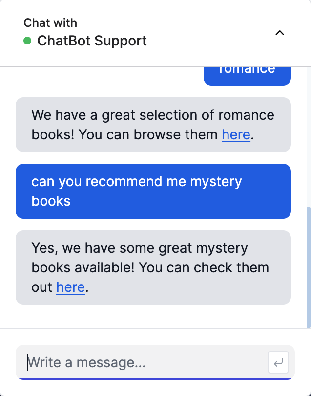

# ChatBot

[Live App](https://open-ai-chat-bot-nine.vercel.app/)

## Introduction
Chatbot implemented using OpenAI API to utilize AI in helping answer user questions in regards to the bookstore and its contents. Chatbot has knowledge of the store contents and is capable of making suggestions to the user.

## Tech
Next.js, React, TypeScript, Tailwind CSS

## Features
<ul>
  <li>Streamed real-time responses from OpenAI API</li>
  <li>Optimistic updates for better UX</li>
  <li>Easy to use with intutive UI</li>
  <li>Secured API routes using Redis for rate limiting</li> 
</ul>

## Screenshots

